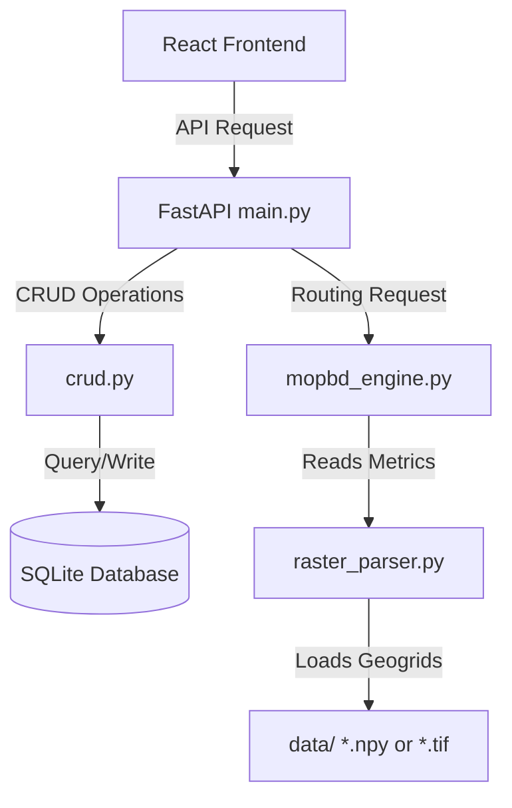
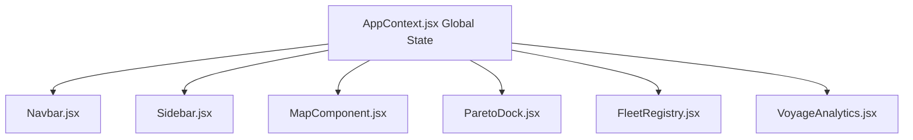

# Aegir Maritime OS - Comprehensive Project Documentation

Aegir Maritime OS is a production-grade, full-stack maritime routing and fleet command center. The application computes Pareto-optimal shipping voyages using a **Multi-Objective Path-Based D* Lite (MOPBD*)** algorithm, balancing travel time, bunker fuel consumption, and navigational safety hazards (waves, winds, current shifts, and piracy hot spots) across the Indian Ocean.

This document provides a highly detailed, file-by-file structural breakdown and algorithmic overview of both the frontend (React + Tailwind CSS + Leaflet + Recharts) and backend (FastAPI + SQLite + SQLAlchemy + NumPy) systems.

---

## 📂 Project Directory Structure

```
SIH/
├── backend/
│   ├── app/
│   │   ├── database.py       # SQLite connection session & dependency injection
│   │   ├── models.py         # SQLAlchemy Ship database model
│   │   ├── schemas.py        # Pydantic validation schemas & request models
│   │   ├── crud.py           # Database CRUD utility methods for Fleet Registry
│   │   ├── main.py           # FastAPI server routes, CORS config & API endpoints
│   │   ├── mopbd_engine.py   # Multi-Objective D* Lite & Pareto path computations
│   │   ├── raster_parser.py  # Environmental grid layers parser (with NumPy fallback)
│   │   └── generator.py      # Environment grid generator & DB seeder
│   ├── tests/
│   │   └── test_mopbd.py     # PyTest validation suite (endpoints, DB & algorithm)
│   ├── run.py                # Server startup execution script
│   └── requirements.txt      # Python dependencies manifest
├── frontend/
│   ├── src/
│   │   ├── components/
│   │   │   ├── FleetRegistry.jsx    # CRUD Interface for registering and editing ships
│   │   │   ├── MapComponent.jsx     # Leaflet map canvas rendering routes and storm zones
│   │   │   ├── Navbar.jsx           # Top command header & active warnings banner
│   │   │   ├── ParetoDock.jsx       # Side-by-side Pareto path comparative deck
│   │   │   ├── Sidebar.jsx          # Route configurations, weights & simulation triggers
│   │   │   └── VoyageAnalytics.jsx  # Recharts trade-off bar charts & telemetry playback
│   │   ├── context/
│   │   │   └── AppContext.jsx       # React global state manager and UI-to-API logic
│   │   ├── App.css                  # Custom scrollbar & visual command styling
│   │   ├── App.jsx                  # Main command center layout & tab coordinator
│   │   ├── index.css                # Tailwind directives & custom Leaflet dark styles
│   │   └── main.jsx                 # React root DOM renderer
│   ├── tailwind.config.js           # Design tokens, custom colors & dark-mode styling
│   └── package.json                 # Node package configuration & scripts manifest
├── README.md                        # Quick setup and introduction guide
└── project_documentation.md         # Detailed technical breakdown (This document)
```

---

## ⚙️ Backend Architecture (Python FastAPI)

The backend is built around a modular architecture serving database CRUD actions, parsing environmental raster arrays, and calculating dynamic multi-objective route vectors.



### 1. `database.py`
[database.py](file:///Users/zainab/SIH/backend/app/database.py) establishes the local SQLite connection using SQLAlchemy.
*   **Database URL:** `sqlite:///./aegir.db`
*   **Engine Config:** Uses `connect_args={"check_same_thread": False}` because SQLite runs single-threaded by default, which allows FastAPI to process multi-threaded requests safely on the same connection.
*   **SessionLocal:** Session builder configured with `autocommit=False` and `autoflush=False`.
*   **get_db() dependency:** A generator function yielding database sessions and ensuring they are closed securely after request completion.

### 2. `models.py`
[models.py](file:///Users/zainab/SIH/backend/app/models.py) defines the `Ship` database schema mapped via SQLAlchemy:
*   `id`: Primary key (Integer).
*   `name`: Ship identifier (String).
*   `imo`: International Maritime Organization number (String, unique indexed).
*   `displacement`: Displacement in metric tons (Float).
*   `frontal_area`: Cross-sectional windage area in $m^2$ (Float).
*   `engine_efficiency`: Thermal efficiency coefficient, e.g., `0.45` (Float).
*   `sfoc`: Specific Fuel Oil Consumption in $g/kWh$ (Float).
*   `risk_index`: Risk safety benchmark score (Float, defaults to `15.0`).
*   `maintenance_schedule`: Scheduled check log (String).
*   `parts_replacement_log`: Registry of replaced components (String).

### 3. `schemas.py`
[schemas.py](file:///Users/zainab/SIH/backend/app/schemas.py) contains Pydantic schema validation wrappers for type safety:
*   `ShipBase`, `ShipCreate`, `ShipUpdate`, `Ship`: Handles requests to modify/retrieve ship objects.
*   `WeightSliders`: Strict validation for weights (Safety, Fuel, Time) constraints between `0.0` and `1.0`.
*   `RouteRequest`: Standard structure representing inputs for route calculations (Origin, Destination, Ship ID, Weights).
*   `ReplanRequest`: Input structure for D* Lite replanning after a storm appears, capturing the vessel's current path index, storm coordinate, and storm radius.

### 4. `crud.py`
[crud.py](file:///Users/zainab/SIH/backend/app/crud.py) implements the ORM CRUD queries:
*   `get_ship()` & `get_ships()`: Fetches individual ships or arrays of ships.
*   `create_ship()`: Validates and saves new ship records.
*   `update_ship()`: Implements partial updates (`model_dump(exclude_unset=True)`) to modify specific vessel values.
*   `delete_ship()`: Deletes vessel profiles from the registry.

### 5. `raster_parser.py`
[raster_parser.py](file:///Users/zainab/SIH/backend/app/raster_parser.py) handles geographic grid indexing:
*   **Geographical Bounds:** Indian Ocean covering Latitudes $[-25^\circ\text{S}, 25^\circ\text{N}]$ and Longitudes $[40^\circ\text{E}, 110^\circ\text{E}]$. Grid resolution is $70 \times 50$ cells (1-degree resolution).
*   **Rasterio Loader:** Tries to read `.tif` GeoTIFF maps.
*   **NumPy Fallback:** If GDAL libraries are missing, it falls back to parsing pre-compiled `.npy` files.
*   `get_metrics(lat, lon)`: Converts input coordinates into array indexes using:
    $$\text{col} = \frac{\text{lon} - \text{West}}{\text{East} - \text{West}} \times (\text{Width} - 1)$$
    $$\text{row} = \frac{\text{North} - \text{lat}}{\text{North} - \text{South}} \times (\text{Height} - 1)$$
    Then, it queries wind, wave, currents (vector components $U, V$), and piracy risk at that coordinate.
*   `inject_storm(center_lat, center_lon, radius_deg, severity)`: Simulates storm formation by applying a Gaussian-decay risk weight onto all grid cells within the radius, updating waves and wind values dynamically in memory.

### 6. `generator.py`
[generator.py](file:///Users/zainab/SIH/backend/app/generator.py) populates the project with mock data:
*   Generates Indian Ocean maps with a high-wave/high-wind zone representing monsoons.
*   Applies a localized mathematical density function to seed piracy hot spots around the Gulf of Aden ($12^\circ\text{N}, 45^\circ\text{E}$) and Somali Basin ($5^\circ\text{N}, 50^\circ\text{E}$).
*   Saves the data as GeoTIFF files or NumPy binary arrays.
*   Seeds the SQLite database with three default vessel profiles: *Aegir Container*, *Aegir Tanker*, and *Aegir Carrier*.

### 7. `main.py`
[main.py](file:///Users/zainab/SIH/backend/app/main.py) is the entrypoint to the FastAPI app:
*   Enables full CORS (Cross-Origin Resource Sharing) middleware to allow standard cross-origin frontend queries.
*   Maps RESTful endpoints:
    *   `GET /api/ships`, `GET /api/ships/{id}`, `POST /api/ships`, `PUT /api/ships/{id}`, `DELETE /api/ships/{id}`.
    *   `POST /api/routes/calculate`: Retrieves the selected ship specifications, normalizes user weight sliders, and calculates the Pareto optimal front.
    *   `POST /api/routes/replan`: Simulates weather radar shifts, updates the grid via `inject_storm()`, and triggers incremental D* Lite tree repairs from the vessel's current waypoint.
    *   `GET /api/weather/layers`: Exports the raw grid matrices for visualization in the UI.

---

## 🧮 Algorithmic & Mathematical Modeling

The core value of Aegir Maritime OS lies in its mathematical modeling of vessel physics and pathfinding.

### 1. Multi-Objective Cost Modeling
For any edge connecting grid nodes $u$ to $v$, the cost is calculated as a vector of three objectives:
$$c(u, v) = [T(u,v), F(u,v), R(u,v)]$$

#### A. Travel Time ($T$) in Hours:
The speed of the vessel is subject to environmental resistance:
$$V_{\text{eff}} = V_{\text{base}} - \text{SpeedLoss} + \text{CurrentAssist}$$
*   **Base Speed ($V_{\text{base}}$):** Determined by vessel displacement ($13.0\text{ knots}$ for Tankers, $12.0\text{ knots}$ for Bulk Carriers, and $20.0\text{ knots}$ for Container Ships).
*   **Current Assist:** Calculated by projecting ocean current vectors $(U_c, V_c)$ onto the unit direction vector $(\text{dx}, \text{dy})$ of the vessel's movement:
    $$\text{CurrentAssist} = U_c \cdot \text{dx} + V_c \cdot \text{dy}$$
*   **Speed Loss:** Drag induced by surface winds and wave heights:
    $$\text{SpeedLoss} = 0.04 \cdot \text{wind} + 0.6 \cdot \text{wave}$$
*   **Effective Speed ($V_{\text{eff}}$):** Clamped at a minimum of $2.5\text{ knots}$ to ensure forward progress.
*   **Time Cost:**
    $$T(u,v) = \frac{\text{Distance}(u,v)}{V_{\text{eff}}}$$
    *(Distance is calculated using the spherical Haversine formula).*

#### B. Bunker Fuel Consumption ($F$) in Gallons:
Fuel rate scales non-linearly with speed (propeller physics cube relation) plus environmental added resistances:
$$P_{\text{total}} = \frac{P_{\text{base}} + P_{\text{wind\_drag}} + P_{\text{wave\_resistance}}}{\eta_{\text{engine}}}$$
*   **Base Propulsion Power ($P_{\text{base}}$):**
    $$P_{\text{base}} = 0.005 \cdot \text{Displacement}^{2/3} \cdot V_{\text{eff}}^3 \cdot 0.001 \quad (\text{kW})$$
*   **Wind Drag Power ($P_{\text{wind\_drag}}$):**
    $$P_{\text{wind\_drag}} = 0.001 \cdot \text{FrontalArea} \cdot \rho_{\text{air}} \cdot V_{\text{eff}} \cdot \text{wind}^2 \cdot 10^{-4} \quad (\text{where } \rho_{\text{air}} = 1.2 \text{ kg/m}^3)$$
*   **Wave Added Resistance Power ($P_{\text{wave\_resistance}}$):**
    $$P_{\text{wave\_resistance}} = 0.05 \cdot \text{Displacement}^{1/3} \cdot \text{wave}^2 \cdot V_{\text{eff}}$$
*   **Total Power ($P_{\text{total}}$):** Divided by engine efficiency $\eta_{\text{engine}}$, clamped at a minimum baseline of $1000\text{ kW}$ to account for ship auxiliaries.
*   **Fuel Volume (Gallons):**
    $$F(u,v) = \frac{\text{SFOC} \cdot P_{\text{total}} \cdot T(u,v)}{\rho_{\text{fuel}}} \quad (\text{where } \rho_{\text{fuel}} = 3200\text{ g/gallon for marine diesel})$$

#### C. Navigational Safety Risk ($R$):
$$\text{RiskCell} = 1.0 + \text{wave}^{2.2} + 0.2 \cdot \text{wind} + 2.5 \cdot \text{piracy}$$
$$R(u,v) = \text{Distance}(u,v) \cdot \text{RiskCell}$$

---

### 2. Multi-Objective Path-Based D* Lite (MOPBD*)
To find the shortest path under scalarized weights, the engine runs D* Lite. The cost function scalarizes the vector:
$$\text{Cost}(u,v) = w_t \cdot T(u,v) + w_f \cdot \frac{F(u,v)}{80.0} + w_s \cdot \frac{R(u,v)}{8.0}$$
*(Divisors $80.0$ and $8.0$ normalize the objectives to equivalent magnitudes).*

```mermaid
graph TD
    Start([Start Replanning]) --> SetLast[Set s_last = s_start]
    SetLast --> SetStart[Set s_start = current ship coordinate]
    SetStart --> UpdateKm[Update km += Heuristic(s_last, s_start)]
    UpdateKm --> LoopCells[For each changed grid cell & neighbors]
    LoopCells --> UpdateVertex[UpdateVertex u]
    UpdateVertex --> Queue{g u != rhs u?}
    Queue -->|Yes| Push[Push/Update u in Priority Queue U]
    Queue -->|No| Pop[Remove u from Queue]
    Push --> Compute[ComputeShortestPath]
    Pop --> Compute
    Compute --> Finish([Path Repaired])
```

#### D* Lite Mechanics:
1.  **Search Direction:** Searches backward from the Goal node ($s_{\text{goal}}$) to the Start node ($s_{\text{start}}$). This allows the path to adapt dynamically near the vessel without re-computing the entire search tree when the ship moves or weather conditions shift.
2.  **RHS and G Values:**
    *   $g(s)$ represents the estimated cost from the state $s$ to the goal.
    *   $rhs(s)$ is a lookahead value based on neighbor costs:
        $$rhs(s) = \min_{s' \in \text{Successors}(s)} \left( \text{Cost}(s, s') + g(s') \right)$$
3.  **Consistency:**
    *   If $g(s) = rhs(s)$, the state is **consistent**.
    *   If $g(s) > rhs(s)$, the state is **underconsistent** (costs decreased, needs to propagate).
    *   If $g(s) < rhs(s)$, the state is **overconsistent** (costs increased, needs to repair).
4.  **Priority Queue keys:**
    *   D* Lite orders node expansion based on a two-tuple key:
        $$k(s) = [k_1(s), k_2(s)] = [\min(g(s), rhs(s)) + h(s, s_{\text{start}}) + k_m, \; \min(g(s), rhs(s))]$$
        *   $h(s, s_{\text{start}})$ is the optimistic Haversine heuristic.
        *   $k_m$ is an accumulator track variable that adjusts for ship movements to avoid re-evaluating the entire queue.
5.  **Incremental Repair (`replan_after_weather_shift`)**:
    *   When weather coordinates change, only cells affected by the storm are updated.
    *   `update_vertex()` is called on all modified cells and their immediate grid neighbors to re-evaluate their RHS values.
    *   `compute_shortest_path()` runs selectively, adjusting only inconsistent branches. This process is highly efficient and completes in milliseconds.

---

### 3. Pareto Front Generator
Because no single route is best for all objectives, the engine generates a Pareto front comparing four distinct trade-offs:
1.  **Fastest:** Highly weights travel time ($w_t = 0.90, w_f = 0.05, w_s = 0.05$).
2.  **Fuel-Optimized:** Highly weights fuel savings ($w_t = 0.05, w_f = 0.90, w_s = 0.05$).
3.  **Safest:** Highly weights safety risk reduction ($w_t = 0.05, w_f = 0.05, w_s = 0.90$).
4.  **Balanced:** Computes custom routing using the specific weights set on the frontend sliders.

---

## 🎨 Frontend Architecture (React + Tailwind CSS)

The frontend is a single-page application focused on high-performance geospatial rendering, telemetry playback, and interactive sliders.



### 1. `AppContext.jsx`
[AppContext.jsx](file:///Users/zainab/SIH/frontend/src/context/AppContext.jsx) serves as the centralized state coordinator:
*   **State variables:** Active vessel selection, selected departure and destination ports, active routes, active storm coordinates, telemetry playback counters, and loaded weather layers.
*   **Weight Auto-Balancing Logic:** Implements proportional scaling to guarantee the weight sum is always exactly `1.0`. When one slider is adjusted, the other two scale proportionally based on their current ratio:
    ```javascript
    const remain = 1.0 - inputVal;
    const totalOther = otherVal1 + otherVal2;
    // Scale remaining value onto other weights proportionally...
    ```
*   **API Handlers:** Wraps async fetch calls for `/api/routes/calculate` and `/api/routes/replan`.
*   **Telemetry Playback Timer:** Sets an interval of `1.5` seconds to increment the ship's current index, simulating real-time voyage progress on the map.

### 2. `App.jsx`
[App.jsx](file:///Users/zainab/SIH/frontend/src/App.jsx) establishes the top-level layout:
*   Features a dark tactical theme with custom styling.
*   Coordinates the two main dashboards:
    1.  **Operational Command Room:** Shows the [Sidebar](file:///Users/zainab/SIH/frontend/src/components/Sidebar.jsx), Leaflet [MapComponent](file:///Users/zainab/SIH/frontend/src/components/MapComponent.jsx), and [ParetoDock](file:///Users/zainab/SIH/frontend/src/components/ParetoDock.jsx).
    2.  **Fleet Control & Analytics:** Renders aggregate KPI cards (Active Fleet Voyages, Total Bunker Fuel, Fleet Safety Index, and Cumulative $CO_2$ Offset) alongside sub-tabs for the [FleetRegistry](file:///Users/zainab/SIH/frontend/src/components/FleetRegistry.jsx) and [VoyageAnalytics](file:///Users/zainab/SIH/frontend/src/components/VoyageAnalytics.jsx).

### 3. `Navbar.jsx`
[Navbar.jsx](file:///Users/zainab/SIH/frontend/src/components/Navbar.jsx) renders the top header bar:
*   Displays the active status indicator ("Live API Sync").
*   Triggers a red flashing banner warning when a storm simulation is active: `"Active Storm Alert: Dynamic D* Lite Replanning Active"`.

### 4. `Sidebar.jsx`
[Sidebar.jsx](file:///Users/zainab/SIH/frontend/src/components/Sidebar.jsx) provides the operational controls:
*   **Departure/Destination Port Pickers:** Restricts choices to prevent selecting the same port for both origin and destination.
*   **Vessel Selection:** Dropdown list dynamically populated from the database.
*   **Manual Overrides:** Allows users to expand a panel to manually tweak displacement, frontal area, SFOC, and engine efficiency directly in the UI.
*   **Weight Sliders:** safety, fuel, and travel time priority controls.
*   **Action Buttons:** Triggers route calculations and storm simulations.

### 5. `MapComponent.jsx`
[MapComponent.jsx](file:///Users/zainab/SIH/frontend/src/components/MapComponent.jsx) renders the Leaflet map:
*   Loads the **CartoDB Dark Matter** dark tile layers.
*   Plots color-coded route lines: **Red** (Fastest), **Blue** (Fuel Optimized), **Green** (Safest), and **Purple** (Balanced).
*   **HUD Overlays Control:** Toggles overlays displaying surface winds, wave heights, and piracy risks using semi-transparent circles to match the tactical dark theme.
*   **Storm Center Visualizer:** Displays a red pulsing circle mapping the active storm radar.
*   **Glow Ship Marker:** Custom SVG ship icon that follows the active route index during telemetry simulation.

### 6. `ParetoDock.jsx`
[ParetoDock.jsx](file:///Users/zainab/SIH/frontend/src/components/ParetoDock.jsx) displays the path comparison cards:
*   Allows side-by-side comparison of duration, fuel, and risk metrics for all four routes.
*   Clicking a card selects the route and highlights it on the map.

### 7. `FleetRegistry.jsx`
[FleetRegistry.jsx](file:///Users/zainab/SIH/frontend/src/components/FleetRegistry.jsx) handles database management:
*   Provides forms to register new vessels or edit/decommission existing ones.
*   Features a responsive grid displaying ship specifications, maintenance history, and parts logs.
*   Displays hull risk ratings using circular SVG progress gauges.

### 8. `VoyageAnalytics.jsx`
[VoyageAnalytics.jsx](file:///Users/zainab/SIH/frontend/src/components/VoyageAnalytics.jsx) provides key performance indicators (KPIs) and telemetry charts:
*   **Recharts Comparison:** Renders bar charts comparing route options across Travel Time, Bunker Fuel, and Risk parameters.
*   **Vessel Progress Indicators:** Calculates elapsed hours, remaining hours, and nautical miles in real time.
*   **Emergency Search & Rescue (SAR) Asset Locator:** Dynamically calculates and displays distance metrics to the closest rescue units, Navy escorts, and support vessels relative to the ship's current position.

---

## 🛠️ Installation & Execution Guidelines

### Backend Setup
1.  Navigate to the backend directory:
    ```bash
    cd backend
    ```
2.  Set up and activate a Python virtual environment:
    ```bash
    python3 -m venv venv
    source venv/bin/activate
    ```
3.  Install dependencies:
    ```bash
    pip install -r requirements.txt
    ```
4.  Generate map rasters and seed the SQLite database:
    ```bash
    python3 -m app.generator
    ```
5.  Start the FastAPI server:
    ```bash
    python3 run.py
    ```
    *The server runs locally at `http://127.0.0.1:8000`.*

### Frontend Setup
1.  Navigate to the frontend directory:
    ```bash
    cd ../frontend
    ```
2.  Install packages:
    ```bash
    npm install
    ```
3.  Start the development server:
    ```bash
    npm run dev
    ```
    *Open `http://localhost:5173/` in your browser.*

### Running Tests
Execute the PyTest suite to verify endpoints and pathfinding math:
```bash
cd backend
PYTHONPATH=. pytest tests/
```
